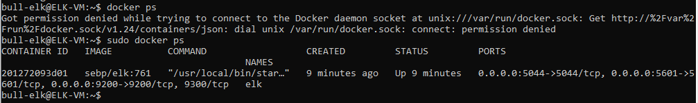

## Automated ELK Stack Deployment

The files in this repository were used to configure the network depicted below.

These files have been tested and used to generate a live ELK deployment on Azure. They can be used to either recreate the entire deployment pictured above. Alternatively, select portions of the playbook file may be used to install only certain pieces of it, such as Filebeat.

  - _install-elk.yml_

This document contains the following details:
- Description of the Topology
- Access Policies
- ELK Configuration
  - Beats in Use
  - Machines Being Monitored
- How to Use the Ansible Build

### Description of the Topology

The main purpose of this network is to expose a load-balanced and monitored instance of DVWA, the D*mn Vulnerable Web Application.

Load balancing ensures that the application will be highly available, in addition to restricting access to the network.
- _Load balancers protect the system from DoS attacks by shifting attack traffic to a public cloud provider. The advantage of a jump box is to give access to the user from a single machine that can be secured and monitored._

Integrating an ELK server allows users to easily monitor the vulnerable VMs for changes to the logs and system configuration.
- _Filebeat watches log files or locations that are specified. It collects log events, and forwards them for indexing._
- _Metricbeat, as the name implies, collects and records metrics from the system and services running on the server._

The configuration details of each machine may be found below.

| Name     | Function   | IP Address | OS    |
|----------|------------|------------|-------|
| Jump Box | Gateway    | 10.0.0.4   | Linux |
| Web-1    | Web Server | 10.0.0.5   | Linux |
| Web-2    | Web Server | 10.0.0.6   | Linux |
| Web-3    | Web Server | 10.0.0.7   | Linux |
| ELK-VM   | Monitoring | 10.1.0.4   | Linux |

### Access Policies

The machines on the internal network are not exposed to the public Internet. 

Only the Jump Box machine can accept connections from the Internet. Access to this machine is only allowed from the following IP addresses:
- _173.79.250.49_

Machines within the network can only be accessed by SSH through port 22.
- _The only machine allowed to access the ELK VM was the Jumb Box with IP 10.0.0.4_

A summary of the access policies in place can be found in the table below.

| Name     | Publicly Available | Allowed IP Addresses    |
|----------|--------------------|-------------------------|
| Jump Box | Yes                | 173.79.250.49           |
| Web-1    | No                 | 10.0.0.4                |
| Web-2    | No                 | 10.0.0.4                |
| Web-3    | No                 | 10.0.0.4                |
| ELK-VM   | No                 | 173.79.250.49, 10.0.0.4 |

### Elk Configuration

Ansible was used to automate configuration of the ELK machine. No configuration was performed manually, which is advantageous because it saves time and minimizes the potential for error.
- _The main advantage of automating configuration with Ansible, is that the setup includes an inital .yml file that references each playbook's installation files. That main file saves time and effort because it dictates which playbooks are used, making future edits to the machines easier._

The playbook implements the following tasks:
- _Install docker.io, python3-pip, and docker module_
- _Increase virtual memory_
- _Download and launch a docker elk container_

The following screenshot displays the result of running `docker ps` after successfully configuring the ELK instance.

### Target Machines & Beats
This ELK server is configured to monitor the following machines:
- _10.0.0.5_
- _10.0.0.6_
- _10.0.0.7_

We have installed the following Beats on these machines:
- _Filebeat_
- _Metricbeat_

These Beats allow us to collect the following information from each machine:
- _Filebeat watches log files or locations that are specified. It collects log events and forwards them for indexing._
- _Metricbeat, as the name implies, collects and records metrics (time, date, etc) from the system and services running on the server._

### Using the Playbook
In order to use the playbook, you will need to have an Ansible control node already configured. Assuming you have such a control node provisioned: 

SSH into the control node and follow the steps below:
- Copy filebeat-playbook.yml and metricbeat-playbook.yml to /etc/ansible/roles.
- Update the /etc/ansible/hosts file to include the webserver IPs and the ELKServer IP.
- Run the playbook, and navigate to http://<ELK_VM Public IP>:5601/app/kibana#/home to check that the installation worked as expected.

_Answer the following questions to fill in the blanks:_
- _Which file is the playbook?_  install-elk.yml
	- _Where do you copy it?_ /etc/ansible/
- _Which file do you update to make Ansible run the playbook on a specific machine?_ /etc/ansible/hosts
- _How do I specify which machine to install the ELK server on versus which to install Filebeat on?_ In the hosts file, you can specify which server group and associated IPs you want to update and run the playbook.
- _Which URL do you navigate to in order to check that the ELK server is running?_ http://<ELK_VM Public IP>:5601/app/kibana#/home

_As a **Bonus**, provide the specific commands the user will need to run to download the playbook, update the files, etc._

	ansible-playbook /etc/ansible/install-elk.yml